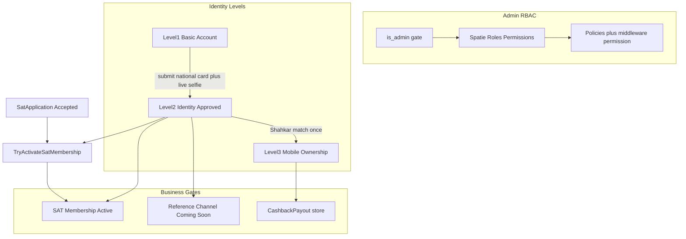

# پیاده‌سازی RBAC + احراز هویت چندسطحی روی bahram-cm

## خلاصه Audit معماری فعلی

پروژه هدف: **[bahram-cm](bahram-cm)** (Laravel 12 + Next.js 16). اپ sibling یعنی `saat` جداست و فقط به‌عنوان مرجع الگوی Spatie استفاده می‌شود.

| حوزه | وضعیت فعلی |
|------|------------|
| Auth | ادمین: email/password + Sanctum؛ دانشجو: OTP موبایل |
| Authorization | فقط `users.is_admin` + middleware `EnsureUserIsAdmin` — بدون Policy/Gate/Spatie |
| `/auth/me` | نقش/پرمیشن **hardcoded** به‌صورت `SUPER_ADMIN` |
| دانشجویان | شماره موبایل **کامل** در list/show؛ Export بدون granular permission |
| Reveal precedent | کارت بانکی در `CashbackPayoutAdminController::show` + لاگ کانال `payment` |
| Mask helper | [`Mobile::mask()`](bahram-cm/backend/app/Support/Mobile.php) از قبل وجود دارد |
| SAT | فقط [`SatApplication`](bahram-cm/backend/app/Models/SatApplication.php) با statusهای `received/reviewing/accepted/rejected` — **عضویت فعال وجود ندارد** |
| برداشت وجه | [`CashbackPayout`](bahram-cm/backend/app/Models/CashbackPayout.php) در باشگاه ارجاع — نه Walletِ saat |
| SMS | [`SmsService::sendEvent`](bahram-cm/backend/app/Services/SmsService.php) + [`SmsEventKey`](bahram-cm/backend/app/Enums/SmsEventKey.php) |
| Events/Listeners | در bahram-cm **وجود ندارد** — side-effectها مستقیم + Job |
| Storage خصوصی | disk `local` (`storage/app/private`) + الگوی encrypt در `CashbackPayout` / `SmsProvider` |
| Audit UI | صفحه `/admin/audit` هست؛ API بک‌اند **نیست** |
| Identity/KYC/Shahkar | هیچ کدی در پروژه نیست |

**تصمیم قفل‌شده:** نصب `spatie/laravel-permission` در bahram-cm (هم‌راستا با saat، بدون سیستم تکراری). نگه داشتن `is_admin` به‌عنوان دروازه ورود به پنل ادمین؛ granularity داخل پنل با Role/Permission.

---

## بخش‌هایی که Reuse می‌شوند (بازنویسی نمی‌شوند)

- Login/OTP، خرید، زرین‌پال، `FulfillOrderJob`، باشگاه ارجاع، `SatApplication` submit
- `SmsService` / `SmsEventConfig` / multi-provider SMS
- UI ادمین (`AdminPage`, `Table`, `field-*`) و پنل دانشجو (`panel-profile-*`, `card`, `btn`)
- الگوی Reveal کارت بانکی برای Reveal موبایل/کدملی/مدارک
- `Mobile::normalize` / `Mobile::mask`
- Private disk و cast `encrypted` لاراول
- Middleware `auth:sanctum` + `admin` / `student.active`
- قرارداد API: `{ data, meta }` و `{ error: { code, message_fa } }`

---

## معماری هدف



**Derived Level (Source of Truth):**
- `identity_verification_status = approved` → Level 2
- + `mobile_ownership_status = verified` → Level 3
- در غیر این صورت Level 1
- ستون cache اختیاری `verification_level` روی profile با sync تراکنشی؛ Drift ممنوع

---

## ۱) Role & Permission

### Backend
- نصب `spatie/laravel-permission`؛ trait `HasRoles` روی [`User`](bahram-cm/backend/app/Models/User.php)
- `EnsureUserIsAdmin` باقی می‌ماند؛ روی routeهای حساس middleware/Policy با `permission:` اضافه می‌شود
- Seeder نقش‌ها: `super-admin`, `admin`, `student-manager`, `kyc-operator`, `support`, `content-manager`, `finance`, `read-only`
- Permissionهای granular (ماژول‌بندی‌شده) مطابق مشخصات — naming با نقطه مثل saat: `students.view_full_mobile`, `identity.approve`, …
- Migration ایمن: همه `is_admin=true` → role `super-admin`
- `AuthController::userPayload` واقعی شود (roles/permissions از Spatie، نه hardcode)
- Anti-lockout: جلوگیری از حذف/گرفتن نقش آخرین Super Admin؛ تأیید برای اکشن‌های حساس
- Export reserved: `students.export` / `students.export_sensitive_data` فقط قابل assign به Super Admin (validation در sync permissions)

### Sensitive data API
- [`StudentController`](bahram-cm/backend/app/Http/Controllers/Api/V1/Admin/StudentController.php): در list/show فقط `mobile_masked`؛ نه `mobile`
- Endpointهای Reveal: `POST /api/v1/students/{id}/reveal-mobile` و `reveal-national-code` با permission + rate limit + audit
- Search با موبایل کامل مجاز (`students.search_by_mobile`) ولی response همیشه masked
- [`StudentExportController`](bahram-cm/backend/app/Http/Controllers/Admin/StudentExportController.php): فقط Super Admin + permission export

### Audit Log
- جدول `admin_audit_logs` (صفحه `/admin/audit` را wire کن)
- سرویس `AdminAuditLogger` با فیلدهای: actor_id, action, subject_type/id, request_id, ip, user_agent, metadata (بدون secret/شماره کامل/کدملی)
- جایگزینی تدریجی لاگ‌های حساس Reveal (کارت/موبایل/کدملی/مدارک/override/role change)

### Admin UI
- جایگزینی mock در [`/admin/users`](bahram-cm/frontend/app/admin/(panel)/users/page.tsx) با مدیریت واقعی ادمین‌ها + نقش‌ها
- صفحات جدید: Roles & Permissions (گروه‌بندی ماژولی)، Audit Logs
- Nav در [`admin-nav.ts`](bahram-cm/frontend/app/admin/(panel)/admin-nav.ts)؛ فیلتر منو بر اساس `can(user, permission)`
- لیست دانشجویان: masked + دکمه Eye برای Reveal (الگوی [`PayoutRow`](bahram-cm/frontend/app/admin/(panel)/academy/cashback-payouts/PayoutRow.tsx))

---

## ۲) Identity Verification (Level 1–3)

### دیتابیس (additive، بدون حذف داده)
جداول جدید (نام دقیق با convention پروژه):
- `user_identity_profiles` — وضعیت هویت/مالکیت، کدملی encrypted + hash unique، attempts، lock
- `identity_verification_submissions` — versioned submissions + status workflow
- `identity_verification_artifacts` — national_card_front / selfie_video روی private disk
- `identity_verification_reviews` — approve / reject / needs_correction + reason codes + correction items
- `identity_verification_attempts` — provider call history (بدون plain mobile/national_code)
- `identity_verification_routes` — capability → primary/fallback provider
- `identity_provider_configs` — schema-aware credentials encrypted
- `identity_verification_overrides` — تغییر دستی Level با دلیل
- `sat_memberships` — access state: `inactive|active|suspended` (سوابق حذف نشوند)

Backfill: برای هر دانشجوی موجود یک `user_identity_profiles` با Level 1 (chunked، بدون lock طولانی).

کدملی: `national_code_encrypted` (Laravel encrypted) + `national_code_hash` = HMAC-SHA256 با کلید اختصاصی config؛ unique index روی hash.

### Workflow Level 2
Status: `not_started|draft|submitted|under_review|needs_correction|approved|rejected`

Actions (پوشه جدید `app/Actions/Identity/` — الگوی saat، برای bahram-cm جدید است):
- Submit / RequestCorrection / Approve / Reject / Resubmit (فقط correction items)
- Storage: `identity-verifications/{user_uuid}/{submission_uuid}/...` روی disk private
- Artifact stream: Policy → Permission → Audit → temporary stream/signed URL کوتاه
- SMS events جدید روی `SmsEventKey`: submitted / approved / needs_correction / rejected

### Live Selfie (Frontend)
- `getUserMedia` + `MediaRecorder` — **بدون** `<input type="file">` برای ویدیو
- متن تصادفی از config قابل‌گسترش؛ ذخیره expected text با submission
- محدودیت ۵–۲۰ ثانیه؛ همگام Frontend/Backend

### SAT Gate (Event-driven، additive)
- Events: `IdentityLevel2Approved`, `SatApplicationAccepted`
- Listener مشترک → `TryActivateSatMembership` (idempotent)
- Hook در [`SatApplicationAdminController::update`](bahram-cm/backend/app/Http/Controllers/Api/V1/Admin/SatApplicationAdminController.php) هنگام `accepted`
- SMS `sat_membership_activated` فقط روی activation واقعی
- Downgrade Level 2 → suspend membership (بدون حذف application/history)
- **Submit فرم SAT در Level 1 بدون محدودیت می‌ماند**

### Level 3 + برداشت
- Gate فقط در [`CashbackPayoutController::store`](bahram-cm/backend/app/Http/Controllers/Api/V1/Student/CashbackPayoutController.php) (Backend اجباری)
- UX: اگر Level 1 → modal «تأیید حساب لازم است»؛ Level 2 → modal مالکیت شماره؛ سپس Shahkar بدون فرم کدملی جدید
- MATCHED → Level 3 یک‌بار؛ MISMATCHED → failed_attempts؛ ۳ بار → lock + admin queue
- خطاهای فنی attempt حساب نمی‌شوند
- تغییر موبایل توسط ادمین (آینده) → revoke Level 3

### Provider Gateway
```
Contracts:
  MobileOwnershipVerificationProvider
  IdentityVideoVerificationProvider (async-ready)

Registry: IdentityVerificationProviderRegistry
Adapters:
  ManualReviewProvider (default Level 2)
  UidEkycProvider / UidShahkarProvider (بر اساس docs رسمی u-id.net)
  ApiIrShahkarProvider (بر اساس docs رسمی api.ir)
  HodaProvider — فقط scaffold/registration؛ Active فقط بعد از config معتبر؛ بدون endpoint جعلی
```
- Routeها per-capability با Primary/Fallback فقط روی TECHNICAL_* نه MISMATCHED
- پنل Super Admin: سرویس‌های احراز هویت + Test Connection + credentials masked (`configured: true`)
- هیچ credential در پروژه فعلی نیست — adapters با interface واقعی docs پیاده می‌شوند؛ بدون invent کردن schema

---

## ۳) Student UI (حفظ Design System)

در [`/panel/profile`](bahram-cm/frontend/app/panel/(shell)/profile/page.tsx):
- بخش اطلاعات حساب (موبایل read-only — از قبل disabled)
- Card «تأیید حساب کاربری» با زبان انسانی (بدون KYC/Level)
- Stepper Flow جدا برای تأیید هویت
- Cards: عضویت سات / کانال مرجع (Coming Soon) / امکانات فعال

در [`/panel/referrals`](bahram-cm/frontend/app/panel/(shell)/referrals/page.tsx):
- قبل از درخواست برداشت، modalهای contextual Level 2/3

در [`/panel/sat`](bahram-cm/frontend/app/panel/(shell)/sat/page.tsx):
- نمایش وضعیت دسترسی (Locked اگر accepted ولی بدون Level 2؛ Active اگر membership فعال)

---

## ۴) Admin UI جدید

| Module | مسیر پیشنهادی |
|--------|----------------|
| احراز هویت Queue/Dashboard | `/admin/academy/identity-verifications` |
| بررسی پرونده | `/admin/academy/identity-verifications/[id]` |
| Ownership Locked Queue | همان ماژول با filter |
| سرویس‌های احراز هویت | `/admin/settings/identity-providers` |
| Roles & Permissions | `/admin/access/roles` |
| Audit Logs | wire کردن `/admin/audit` |

صفحه بررسی: مدارک فقط با permission؛ Reveal جدا؛ اکشن‌های تأیید/اصلاح/رد + «پرونده بعدی».

---

## ۵) امنیت و سازگاری

- هیچ Breaking Change روی endpointهای عمومی دانشجو/خرید؛ فقط hardening پاسخ‌های ادمین دانشجویان (masked) — breaking محدود و عمدی برای جلوگیری از leak
- Level 1 = رفتار فعلی بدون gate جدید روی login/خرید/فرم/SAT submit/باشگاه
- بدون Payment Flow برای KYC
- لاگ‌ها: جلوگیری از serialize کامل User با فیلدهای حساس در context exception
- Rate limit روی Reveal و Submit و Shahkar verify

---

## ۶) تست‌ها (Pest، مطابق مشخصات)

پوشش Feature/Unit برای RBAC reveal/export/search، uniqueness کدملی، Level 1 regression، Level 2 workflow، SAT activation دو ترتیب event، Level 3 attempts/lock، Provider resolve/fallback/credentials، Override side-effects.

---

## ترتیب پیاده‌سازی پیشنهادی

1. Spatie + roles seeder + migrate admins + `/auth/me` واقعی + middleware permission
2. Audit log foundation
3. Student masking + Reveal + Export lock + Admin student UI
4. Identity tables/models/enums + Level 1 backfill
5. Level 2 student submit + private artifacts + live video UI
6. Admin KYC queue/review + SMS events
7. SatMembership + TryActivate + hooks
8. Provider gateway + Manual + Shahkar adapters + admin config UI
9. Level 3 ownership + CashbackPayout gate + lock queue
10. Profile/Reference/SAT access cards + Override UI
11. تست‌ها + E2E smoke
