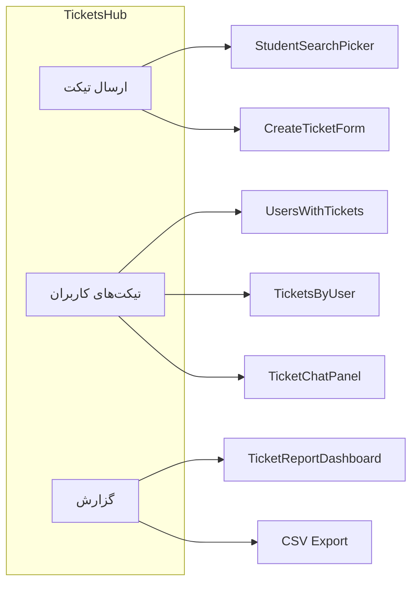
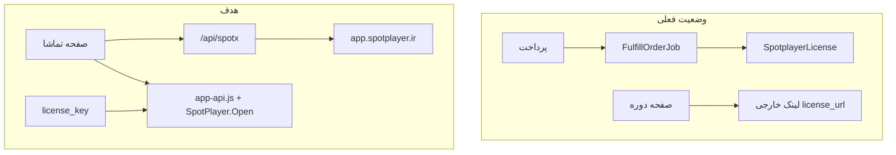
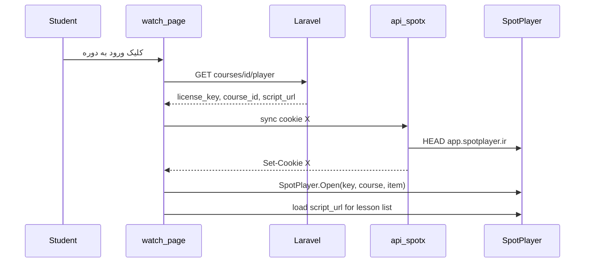

# بازطراحی پنل دانشجو + SpotPlayer + مرکز تیکت ادمین

---

## فاز ۰ — مرکز تیکت ادمین (اولویت فوری — جدا از پنل دانشجو)

### وضعیت فعلی تیکت ادمین

صفحه [`/admin/academy/tickets`](bahram-cm/frontend/app/admin/(panel)/academy/tickets/page.tsx) فرم ارسال و جدول تیکت را در یک صفحه قاطی کرده؛ انتخاب دانشجو با input موبایل دستی است ([`CreateTicketForStudentForm.tsx`](bahram-cm/frontend/app/admin/(panel)/academy/tickets/CreateTicketForStudentForm.tsx)). جزئیات تیکت ([`TicketDetailPanel.tsx`](bahram-cm/frontend/app/admin/(panel)/academy/tickets/TicketDetailPanel.tsx)) لیست ساده پیام است، نه چت. ستون اولویت در جدول و فرم وجود دارد.

### ساختار جدید صفحه — ۳ بخش مجزا

تبدیل صفحه به **کلاینت هاب** با تب/ناو داخلی:

| تب | محتوا |
|---|---|
| **ارسال تیکت** | فرم اختصاصی ارسال پیام به دانشجو (بدون اولویت) |
| **تیکت‌های کاربران** | نمای دو ستونه: لیست دانشجوها + تیکت‌های همان کاربر |
| **گزارش** | آمار و خروجی CSV |

فایل پیشنهادی: [`TicketsHubClient.tsx`](bahram-cm/frontend/app/admin/(panel)/academy/tickets/TicketsHubClient.tsx) — `page.tsx` فقط داده اولیه را پاس می‌دهد.



### ۰.۱ انتخاب دانشجو — StudentSearchPicker

کامپوننت جدید: [`StudentSearchPicker.tsx`](bahram-cm/frontend/app/admin/(panel)/academy/tickets/StudentSearchPicker.tsx)

- دکمه/فیلد «انتخاب دانشجو» → **پاپ‌آپ** (modal/dropdown) با:
  - input جستجو (debounce 300ms)
  - لیست فشرده: **نام و نام‌خانوادگی** + **موبایل** (`dir=ltr`)
  - جستجو روی `name`, `mobile`, `email` از API موجود `GET /students?search=`
- انتخاب → `user_id` در state (جایگزین input موبایل)
- نمایش chip انتخاب‌شده با امکان پاک کردن
- action `createTicketForStudent` فقط با `user_id` (بدون `mobile`)

از [`getStudents`](bahram-cm/frontend/lib/admin/academyData.ts) یا fetch مستقیم در کلاینت استفاده شود.

### ۰.۲ حذف اولویت

- حذف فیلد اولویت از فرم ارسال
- حذف ستون اولویت از جدول‌ها
- حذف `priority` از validation در [`TicketAdminController::store`](bahram-cm/backend/app/Http/Controllers/Api/V1/Admin/TicketAdminController.php) و `update` (همیشه `normal` در DB — بدون migration)
- حذف `TICKET_PRIORITY_LABELS` از UI تیکت (نگه‌داشتن enum در backend برای سازگاری)

### ۰.۳ تب «تیکت‌های کاربران» — گروه‌بندی per user

**Layout دسکتاپ (`lg`):**
```
┌──────────────────┬────────────────────────────┐
│ جستجوی دانشجو    │  هدر: نام + موبایل + لینک  │
│ لیست کاربران     │  ─────────────────────────  │
│ (تعداد تیکت)     │  TicketChatPanel (چت)       │
│                  │  یا لیست تیکت‌ها اگر چندتاست │
└──────────────────┴────────────────────────────┘
```

**موبایل:** ابتدا لیست کاربران → کلیک → صفحه/دراور تیکت‌ها → کلیک تیکت → چت

**Backend جدید:**
- `GET /admin/tickets/users` — دانشجویانی که تیکت دارند: `{ user_id, name, mobile, tickets_count, last_ticket_at, open_count }`
- `GET /admin/tickets?user_id=` — فیلتر تیکت‌های یک کاربر (گسترش `index` موجود)
- `GET /admin/tickets/{id}/messages` اختیاری برای polling سبک (یا reuse `show`)

### ۰.۴ UI چت — TicketChatPanel

بازنویسی [`TicketDetailPanel.tsx`](bahram-cm/frontend/app/admin/(panel)/academy/tickets/TicketDetailPanel.tsx) → `TicketChatPanel.tsx`:

| ویژگی | جزئیات |
|---|---|
| حباب‌ها | دانشجو چپ / اپراتور راست (RTL-aware) با رنگ متمایز |
| هدر چت | موضوع، وضعیت (select)، لینک پروفایل دانشجو، دکمه بستن تیکت |
| ورودی ثابت پایین | textarea + دکمه ارسال؛ Enter=ارسال، Shift+Enter=خط جدید |
| auto-scroll | اسکرول به آخرین پیام پس از load/ارسال |
| polling | هر ۱۰ثانیه `show` برای پیام‌های جدید (وقتی تب visible) |
| زمان | timestamp زیر هر پیام؛ جداکننده روز («امروز»، «دیروز») |
| پیوست | نمایش لینک دانلود اگر `has_attachment` (آپلود ادمین = فاز بعدی) |
| نام فرستنده | گسترش API: `sender_name` در هر message |

هم‌تراز با پنل دانشجو ([`support/[id]/page.tsx`](bahram-cm/frontend/app/panel/(shell)/support/[id]/page.tsx)) ولی با امکانات اپراتور (تغییر وضعیت، بستن).

**مسیر:** `/admin/academy/tickets/[id]` یا inline در هاب — پیشنهاد: چت inline در تب «تیکت‌های کاربران» + صفحه مستقیم `[id]` برای deep link.

### ۰.۵ تب گزارش

**Backend:** `GET /admin/tickets/reports`

```json
{
  "summary": { "total": 120, "open": 15, "answered": 40, "waiting_user": 20, "closed": 45 },
  "by_department": [{ "department": "technical", "count": 30 }],
  "by_day": [{ "date": "2026-07-01", "created": 5, "closed": 2 }],
  "top_users": [{ "user_id": 1, "name": "...", "count": 8 }]
}
```

Query params: `from`, `to`, `status`, `department`

**Frontend:** [`TicketReportPanel.tsx`](bahram-cm/frontend/app/admin/(panel)/academy/tickets/TicketReportPanel.tsx)
- ۴ کارت خلاصه وضعیت
- نمودار ساده (Recharts — از قبل در پروژه برای orders)
- دکمه **خروجی CSV** (`GET /admin/tickets/reports/export` یا client-side از داده)

### ۰.۶ فایل‌های کلیدی (تیکت ادمین)

| فایل | تغییر |
|---|---|
| `tickets/page.tsx` | هاب با ۳ تب |
| `StudentSearchPicker.tsx` | جدید |
| `CreateTicketForStudentForm.tsx` | ساده‌سازی + picker |
| `TicketsByUserPanel.tsx` | جدید |
| `TicketChatPanel.tsx` | جایگزین TicketDetailPanel |
| `TicketReportPanel.tsx` | جدید |
| `TicketAdminController.php` | users index, reports, user_id filter, message sender |
| `academy/actions.ts` | `searchStudents`, `fetchTicketUsers`, `fetchTicketReports` |
| `api_v1.php` | routes جدید |

### ۰.۷ ترتیب اجرا (تیکت ادمین)

1. StudentSearchPicker + حذف اولویت + تب ارسال تیکت
2. API گروه‌بندی کاربران + تب تیکت‌های کاربران
3. TicketChatPanel با polling
4. گزارش + CSV

---

## فاز ۱+ — بازطراحی پنل دانشجو + SpotPlayer

## وضعیت فعلی

پنل در مسیر `/panel` با [`PanelShell.tsx`](bahram-cm/frontend/components/student-panel/layout/PanelShell.tsx) و توکن‌های [`panel.css`](bahram-cm/frontend/styles/panel.css) وجود دارد؛ صفحات اصلی پیاده‌اند ولی UI ساده‌تر از ماکاپ است. SpotPlayer فقط لایسنس صادر می‌کند و در [`courses/page.tsx`](bahram-cm/frontend/app/panel/(shell)/courses/page.tsx) لینک خارجی `license_url` نشان داده می‌شود — **پخش embed و `/spotx` وجود ندارد**.



---

## فاز ۱ — زیرساخت UI و موبایل (پایه همه صفحات)

### ۱.۱ Design System
به‌روزرسانی [`panel.css`](bahram-cm/frontend/styles/panel.css):
- رنگ طلایی/نارنجی برای باشگاه مشتریان (`--color-gold`)
- کارت‌های شیشه‌ای با `border` و `shadow-glow`
- کلاس‌های مشترک: `.panel-stat-card`, `.panel-hero-banner`, `.panel-section-title`, `.panel-copy-field`
- **تم پیش‌فرض:** `prefers-color-scheme` در [`PanelThemeContext.tsx`](bahram-cm/frontend/app/panel/PanelThemeContext.tsx) — اگر کاربر قبلاً انتخاب نکرده، از سیستم پیروی کند؛ سوییچ دستی حفظ شود

### ۱.۲ Shell و ناوبری موبایل
بازنویسی [`PanelShell.tsx`](bahram-cm/frontend/components/student-panel/layout/PanelShell.tsx):

| breakpoint | رفتار |
|---|---|
| `< md` | هدر فشرده + جستجوی آیکونی + **نوار پایین ثابت**: خانه، دوره، پشتیبانی، پروفایل |
| `< md` | دکمه همبرگر → drawer برای: سمینارها، باشگاه مشتریان، سات، اعلان‌ها، سفارش‌ها |
| `≥ md` | سایدبار راست ثابت مطابق ماکاپ + جستجوی کامل در هدر |

کامپوننت‌های جدید در `components/student-panel/layout/`:
- `PanelBottomNav.tsx`
- `PanelHeader.tsx` (جستجو، اعلان، آواتار)
- `PanelPageHeader.tsx` (عنوان + توضیح + آیکون — مشترک همه صفحات)

### ۱.۳ الگوی ریسپانسیو
- جداول (`support`, `referrals`) → **کارت‌لیست** زیر `md` با [`PanelDataList.tsx`](bahram-cm/frontend/components/student-panel/ui/PanelDataList.tsx)
- گریدها: `grid-cols-1` موبایل → `sm:2` → `lg:3/4`
- دکمه‌های CTA: `w-full` موبایل، `sm:w-auto` دسکتاپ
- `padding` اصلی: `p-4 pb-20` موبایل (فضا برای bottom nav)
- `touch-action` و حداقل ارتفاع ۴۴px برای دکمه‌ها

---

## فاز ۲ — بازطراحی صفحات (مطابق ماکاپ)

هر صفحه به کامپوننت‌های کوچک تقسیم می‌شود تا نگهداری آسان باشد.

### ۲.۱ خانه [`/panel`](bahram-cm/frontend/app/panel/(shell)/page.tsx)
ماکاپ: کارت خوش‌آمد + ۳ کارت اکشن + چک‌لیست + اعلان‌های اخیر + لینک‌های مهم

- `DashboardWelcome.tsx` — سلام + زیرعنوان
- `DashboardActionCards.tsx` — دوره فعال (لینک به تماشا)، باشگاه مشتریان (مبلغ کش‌بک)، سات
- `DashboardNotificationsPreview.tsx` — ۳ اعلان اخیر از `/notifications`
- `DashboardQuickLinks.tsx` — تلگرام، روبیکا، ربات (از تنظیمات سایت یا config ثابت)
- `OnboardingChecklist.tsx` — بازطراحی با progress bar

**API:** احتمالاً گسترش `GET /student/dashboard` برای خلاصه دوره فعال و کش‌بک (یا compose از چند fetch موجود)

### ۲.۲ دوره [`/panel/courses`](bahram-cm/frontend/app/panel/(shell)/courses/page.tsx)
ماکاپ: breadcrumb، badgeها، کارت SpotPlayer، راهنما، لینک‌های دوره، CTA پشتیبانی

- لیست همه دوره‌ها اگر بیش از یکی باشد
- هر دوره → [`/panel/courses/[accessId]`](bahram-cm/frontend/app/panel/(shell)/courses/[accessId]/page.tsx) (صفحه جزئیات)
- دکمه اصلی: **«ورود به دوره»** → `/panel/courses/[accessId]/watch` (نه لینک خارجی)

### ۲.۳ تماشای SpotPlayer [`/panel/courses/[accessId]/watch`](bahram-cm/frontend/app/panel/(shell)/courses/[accessId]/watch/page.tsx)
صفحه اختصاصی پخش — جزئیات در فاز ۳

### ۲.۴ سمینارها [`/panel/seminars`](bahram-cm/frontend/app/panel/(shell)/seminars/page.tsx)
ماکاپ: آمار، کارت سمینار فعال، ویدیوها، گواهی، گذشته/آینده

- `SeminarStatsRow.tsx`
- `SeminarFeaturedCard.tsx`
- `SeminarVideoList.tsx` (اگر API ویدیو ندارد: placeholder + لینک جزئیات)
- `SeminarCertificateCard.tsx`

### ۲.۵ باشگاه مشتریان [`/panel/referrals`](bahram-cm/frontend/app/panel/(shell)/referrals/page.tsx)
ماکاپ: بنر طلایی، ۴ کارت آمار، جدول معرفی‌ها، کارت بانکی

- `ReferralHeroBanner.tsx` — کد/لینک با دکمه کپی
- `ReferralStatsGrid.tsx` — ۴ کارت (در انتظار، پرداخت‌شده، قابل برداشت، خریدهای موفق)
- `ReferralInviteesTable.tsx` → کارت موبایل
- `CashbackPayoutForm.tsx` — بازطراحی UI کارت بانکی

### ۲.۶ سات [`/panel/sat`](bahram-cm/frontend/app/panel/(shell)/sat/page.tsx)
ماکاپ: فرم + stepper وضعیت + کارت تبلیغاتی

- `SatStatusStepper.tsx`
- `SatApplicationForm.tsx` — UI جدید
- `SatPromoCard.tsx`

### ۲.۷ پشتیبانی [`/panel/support`](bahram-cm/frontend/app/panel/(shell)/support/page.tsx)
نزدیک به ماکاپ است؛ بهبود:
- کارت‌های واتساپ/تلگرام
- FAQ + فرم تیکت در گرید دو ستونه دسکتاپ / تک‌ستونه موبایل
- جدول تیکت‌ها → کارت موبایل

### ۲.۸ پروفایل، اعلان‌ها، سفارش‌ها
بازطراحی سبک‌تر با همان توکن‌ها؛ سفارش‌ها فقط از drawer/منوی ثانویه (نه bottom nav)

---

## فاز ۳ — SpotPlayer درون‌سایتی

مستندات: [SpotPlayer API](https://spotplayer.ir/help/api) — بخش «قرار دادن نسخه وب در سایت»

### ۳.۱ Cookie sync — `/api/spotx`
فایل جدید: [`frontend/app/api/spotx/route.ts`](bahram-cm/frontend/app/api/spotx/route.ts)

منطق (مطابق نمونه PHP در مستندات):
1. خواندن کوکی `X` از request
2. اگر منقضی شده → `HEAD https://app.spotplayer.ir/` با `Cookie: X=...`
3. ست کردن کوکی جدید `X` روی دامنه سایت (`httpOnly: false`, `secure` در production)
4. پاسخ 204 یا redirect سبک

**نکته:** این route باید روی **همان دامنه** صفحه پخش باشد (localhost:3000 در dev).

### ۳.۲ Backend — داده‌های پخش
گسترش [`CourseController.php`](bahram-cm/backend/app/Http/Controllers/Api/V1/Student/CourseController.php):

```php
'spotplayer' => [
    'status' => ...,
    'license_key' => ...,           // فقط برای کاربر مالک
    'spotplayer_course_id' => ...,
    'license_script_path' => ...,   // مسیر نسبی url از DB
    'license_script_url' => 'https://dl.spotplayer.ir{path}?f=js',
    'player_download_url' => ...,   // اختیاری
]
```

endpoint جدید (ترجیحی برای امنیت):
- `GET /student/courses/{courseAccess}/player` — فقط `license_key` + metadata؛ بررسی مالکیت

گسترش [`SpotPlayerService.php`](bahram-cm/backend/app/Services/SpotPlayerService.php):
- افزودن `device.p6: 1` (WebApp) به payload صدور لایسنس
- نرمال‌سازی `license_url` به `https://dl.spotplayer.ir/...` هنگام ذخیره در [`FulfillOrderJob`](bahram-cm/backend/app/Jobs/FulfillOrderJob.php)

**لایسنس‌های قدیمی:** اسکریپت migration/admin یک‌بار `license/edit/$LID` با `device.p6: 1` برای لایسنس‌های فعال — یا دکمه «بازصدور دسترسی وب» در ادمین

### ۳.۳ Frontend — کامپوننت پخش
فایل‌های جدید در `components/student-panel/spotplayer/`:

| فایل | نقش |
|---|---|
| `SpotPlayerScript.tsx` | بارگذاری `https://app.spotplayer.ir/assets/js/app-api.js` |
| `SpotPlayerEmbed.tsx` | `new SpotPlayer(el, '/api/spotx', false)` + `await sp.Open(key, courseId, itemId)` |
| `SpotPlayerLessonList.tsx` | بارگذاری `license_script_url` → `window.spotplayer_courses` → لیست درس‌ها |
| `SpotPlayerInstallGuide.tsx` | اسکریپت `dl.spotplayer.ir/players/?f=js` برای دانلود اپ دسکتاپ |

صفحه [`watch/page.tsx`](bahram-cm/frontend/app/panel/(shell)/courses/[accessId]/watch/page.tsx):
```
┌─────────────────────────────┐
│  #player (aspect-video)     │  ← SpotPlayerEmbed
├─────────────────────────────┤
│  لیست درس‌ها (scroll)       │  ← SpotPlayerLessonList
└─────────────────────────────┘
```

**موبایل:** پلیر `aspect-video` تمام‌عرض؛ لیست درس زیر پلیر با scroll؛ دکمه «تمام‌صفحه» اختیاری

**TypeScript:** تعریف `window.SpotPlayer` و `window.spotplayer_courses` در `types/spotplayer.d.ts`

### ۳.۴ جریان کاربر



---

## فاز ۴ — داده و تنظیمات کمکی

- **لینک‌های اجتماعی داشبورد:** فیلدهای config در تنظیمات سایت (یا env) — تلگرام، روبیکا، واتساپ پشتیبانی
- **FAQ پشتیبانی:** انتقال به CMS/تنظیمات اگر لازم باشد (فعلاً آرایه ثابت قابل قبول)
- **جستجوی هدر:** جستجوی client-side در دوره/سمینار یا defer به فاز بعد

---

## ترتیب اجرا پیشنهادی (کل پروژه)

1. **فاز ۰ — مرکز تیکت ادمین** (درخواست فوری)
2. Shell + design tokens + bottom nav (پنل دانشجو)
3. SpotPlayer backend (`/spotx`, API, `p6`)
4. صفحه watch + embed
5. بازطراحی صفحات پنل دانشجو: خانه → دوره → باشگاه → پشتیبانی → سمینار → سات

---

## تست

| سناریو | انتظار |
|---|---|
| موبایل 375px | bottom nav ثابت، بدون overflow افقی |
| `prefers-color-scheme: dark` | تم تیره بدون فلیکر |
| دوره با لایسنس فعال | لیست درس + پخش داخل سایت |
| دوره بدون لایسنس | پیام راهنما + لینک پشتیبانی |
| لایسنس قدیمی بدون p6 | پیام خطای واضح + راه‌حل ادمین |
| `/api/spotx` | کوکی X به‌روز می‌شود |

---

## فایل‌های کلیدی

| حوزه | فایل‌ها |
|---|---|
| Layout | `PanelShell.tsx`, `PanelBottomNav.tsx`, `panel.css` |
| SpotPlayer API | `app/api/spotx/route.ts`, `SpotPlayerEmbed.tsx`, `CourseController.php`, `SpotPlayerService.php` |
| صفحات | `panel/(shell)/page.tsx`, `courses/[accessId]/`, `referrals/`, `seminars/`, `sat/`, `support/` |
