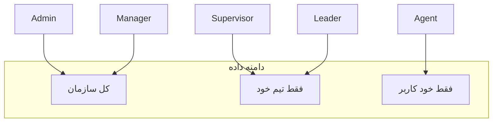

# ماتریس نقش‌ها و دسترسی‌های سات

منبع حقیقت دسترسی‌ها: [`saat/backend/database/seeders/RolePermissionSeeder.php`](saat/backend/database/seeders/RolePermissionSeeder.php) + Policyها در [`saat/backend/app/Policies/`](saat/backend/app/Policies/). UI مینی‌اپ فقط ۴ نقش را می‌شناسد؛ `admin` در فرانت به‌صورت `agent` map می‌شود ([`mapAuthUserRole`](saat/frontend/src/services/auth.ts)).

---

## ۱. کارشناس فروش — `agent`

**نقش:** خط مقدم تماس و فروش.

### فقط agent می‌تواند (بقیه نمی‌توانند)
- **شروع شیفت کاری** — مسیر `/shift-start` اجباری است ([`RequireShift`](saat/frontend/src/App.tsx)); نقش‌های مدیریتی از این قید معاف‌اند.
- **تماس و ثبت نتیجه** — `calls.manage` فقط برای agent؛ API تماس روی لیدهای قابل‌مشاهده خودش.
- **گرفتن لید بعدی از صف** — `POST /leads/next` (تخصیص خودکار برای تماس).
- **قفل/آزاد/بازگرداندن لید به استخر** — روی لیدهای خودش.
- **بازپس‌گیری لید از استخر** — `reclaim` برای agent.
- **ثبت و مدیریت پیگیری** — `followups.manage`: ایجاد، تکمیل، snooze، لغو (فقط پیگیری‌های خودش).
- **ثبت فروش و ارسال پرداخت** — `sales.manage` + `submitPayment` فقط برای فروش خودش.
- **لغو فروش** — فقط فروش خودش در وضعیت‌های `payment_pending` / `payment_submitted`.
- **کیف پول شخصی** — `wallet.view-own`: موجودی، کمیسیون‌ها، درخواست تسویه.
- **صفحه عملکرد شخصی** — تب «گزارش‌ها» در ناوبری → [`/performance`](saat/frontend/src/app/nav.tsx) (گیمیفیکیشن، لیدربورد، دستاورد).
- **منوی پروفایل مخصوص خط فروش** — «وضعیت کاری»، «درآمد من»، «آموزش و اسکریپت» ([`ProfileScreen`](saat/frontend/src/features/profile/ProfileScreen.tsx)).

### محدودیت‌های agent (دیگران می‌توانند)
- لیدها: فقط **لیدهای assign‌شده به خودش** (`leads.view-own`).
- فروش‌ها: فقط **فروش‌های خودش**.
- گزارش تیمی/سازمانی: **ندارد** (`reports.view` ندارد).
- تایید/رد فروش: **ندارد**.
- import لید، auto-assign، reassign: **ندارد**.
- مدیریت کاربر/تیم، محصول، توکن یکپارچه‌سازی: **ندارد**.

---

## ۲. لیدر تیم — `leader`

**نقش:** ناظر عملکرد تیم خود؛ بدون اختیار عملیاتی سنگین.

### دسترسی‌ها
- **مشاهده لیدهای تیم** — `leads.view` + `leads.view-team`؛ Policy: `assigned_team_id === team_id`.
- **مشاهده فروش و کیف پول تیم** — `sales.view-team`, `wallet.view-team`.
- **گزارش‌های تیمی** — `reports.view` + `reports.view-team`؛ API گزارش‌ها scope = تیم ([`ReportsController::teamScope`](saat/backend/app/Http/Controllers/Api/V1/Reports/ReportsController.php)).
- **مشاهده همه پیگیری‌ها و کمیسیون‌ها** (read-only در Policy) — FollowUp/Commission policy برای نقش‌های مدیریتی.
- **آموزش** — فقط `training.view` (مشاهده اسکریپت/اعتراضات).

### UI مدیریتی (مثل supervisor/manager)
- خانه مدیریتی [`ManagementHome`](saat/frontend/src/features/home/ManagementHome.tsx) — «تیم آلفا امروز».
- ناوبری: `/reports` به‌جای `/performance`.
- صفحه [`ReportsScreen`](saat/frontend/src/features/reports/ReportsScreen.tsx): قیف، منابع، عملکرد کارشناسان.

### چیزهایی که leader **نمی‌تواند** (اما نقش بالاتر می‌تواند)
| قابلیت | Leader | Supervisor | Manager | Admin |
|--------|--------|------------|---------|-------|
| تایید/رد فروش (`sales.confirm`) | خیر | بله | بله | بله |
| تخصیص مجدد / auto-assign لید (`leads.reassign`) | خیر | بله | بله | بله |
| import لید CSV (`leads.import`) | خیر | خیر | بله | بله |
| مدیریت تسویه (`wallet.manage-payouts`) | خیر | خیر | بله | بله |
| مدیریت کاربر/تیم (`users.manage`, `teams.manage`) | خیر | خیر | بله | بله |
| ویرایش محصول/کمپین (`admin.products`) | خیر | خیر | بله | بله |
| مدیریت آموزش (`training.manage`) | خیر | بله | بله | بله |
| گزارش کل سازمان (`reports.view-all`) | خیر | خیر | بله | بله |
| باز کردن قفل لید assign‌شده به agent دیگر | خیر | بله* | بله | بله |

\* طبق [`LeadPolicy::lock`](saat/backend/app/Policies/LeadPolicy.php): supervisor/manager/admin می‌توانند روی لید قفل‌شده توسط دیگران lock بزنند.

### نکته UI
در [`SalesScreen`](saat/frontend/src/features/sales/SalesScreen.tsx) لیدر داخل `MANAGER_ROLES` است و دکمه تایید/رد می‌بیند، ولی **API تایید را رد می‌کند** — ناسازگاری فرانت/بک‌اند.

---

## ۳. سوپروایزر — `supervisor`

**نقش:** کنترل کیفیت تیم + اقدام روی pipeline.

### علاوه بر leader می‌تواند
- **تایید و رد فروش** — `sales.confirm`؛ صف `pending-confirmation` (تیمی؛ manager/admin کل سازمان).
- **تخصیص مجدد لید** — `leads.reassign` + `POST /leads/auto-assign`.
- **مدیریت محتوای آموزش** — `training.manage` (permission تعریف شده؛ endpoint اختصاصی هنوز در routes نیست).
- **مشاهده کاربران** — `users.view`.
- **قفل لید assign‌شده به agent دیگر** — Policy lock.

### هنوز نمی‌تواند (فقط manager/admin)
- import لید از CSV.
- `leads.manage` (ویرایش ساختاری لید — permission هست ولی endpoint محدود به import/reassign است).
- مدیریت کاربران/تیم‌ها.
- تسویه و آزادسازی پورسانت (`wallet.manage-payouts`).
- `reports.view-all` (گزارش با scope کل سازمان در API برای manager/admin = `teamScope null`).
- مدیریت محصول/کمپین.
- توکن یکپارچه‌سازی inbound.

### UI
- خانه: «نگاه چند تیمی» ([`ManagementHome`](saat/frontend/src/features/home/ManagementHome.tsx)).
- تایید فروش در SalesScreen.
- کانال realtime `managers` ([`channels.php`](saat/backend/routes/channels.php)).

---

## ۴. مدیر فروش — `manager`

**نقش:** عملیات و گزارش در سطح کل سازمان (بدون اختیارات فنی admin).

### علاوه بر supervisor می‌تواند
- **دید کل سازمان** — لید، فروش، گزارش بدون فیلتر تیم ([`LeadController`](saat/backend/app/Http/Controllers/Api/V1/Leads/LeadController.php), [`SaleController`](saat/backend/app/Http/Controllers/Api/V1/Sales/SaleController.php)).
- **import لید** — `leads.import` + CSV upload.
- **مدیریت کاربران و تیم‌ها** — `users.view`, `users.manage`, `teams.manage` (permission؛ UI/API اختصاصی هنوز محدود).
- **مدیریت تسویه** — `wallet.manage-payouts`: صف payout، approve/reject، release commission.
- **گزارش کل** — `reports.view-all`.
- **محصول و کمپین** — `admin.products` ([`ProductController`](saat/backend/app/Http/Controllers/Api/V1/Admin/ProductController.php), [`CampaignController`](saat/backend/app/Http/Controllers/Api/V1/Admin/CampaignController.php)).

### هنوز نمی‌تواند (فقط admin)
- **توکن یکپارچه‌سازی** — `IntegrationTokenController` صریحاً `hasRole(Admin)` ([`IntegrationTokenController`](saat/backend/app/Http/Controllers/Api/V1/Admin/IntegrationTokenController.php)).
- **`admin.settings`** — permission تعریف شده؛ هنوز در controller استفاده نشده.

### UI اختصاصی
- بخش «روند تیم‌ها» فقط برای `role === 'manager'` در [`ManagementHome`](saat/frontend/src/features/home/ManagementHome.tsx).

---

## ۵. ادمین — `admin`

**نقش:** بالاترین سطح؛ همه permissionها.

### فقط admin
- **ساخت/حذف توکن API یکپارچه‌سازی** (inbound applications) — حتی manager دسترسی ندارد.
- **`admin.settings`** — در seeder به admin داده شده (پیاده‌سازی API هنوز کامل نیست).

### مثل manager + بیشتر
- همه permissionهای [`RolePermissionSeeder`](saat/backend/database/seeders/RolePermissionSeeder.php) برای admin sync می‌شود.
- دید کامل لید/فروش/گزارش در کل سازمان.
- حضور در کانال‌های `team.{id}` و `managers` و `presence-team`.

### محدودیت در مینی‌اپ
- **UI جدا برای admin وجود ندارد** — [`mapAuthUserRole`](saat/frontend/src/services/auth.ts) admin را به `agent` map می‌کند (مگر manager/supervisor/leader هم داشته باشد).
- admin عملاً از مینی‌اپ مثل agent دیده می‌شود مگر نقش ترکیبی داشته باشد.

---

## خلاصه تفاوت‌های کلیدی (چه کسی چه کار منحصربه‌فردی دارد)

| قابلیت | Agent | Leader | Supervisor | Manager | Admin |
|--------|:-----:|:------:|:----------:|:-------:|:-----:|
| تماس/شیفت/ثبت فروش خطی | بله | — | — | — | — |
| داشبورد مدیریتی + گزارش تیمی | — | بله | بله | بله | بله* |
| تایید فروش | — | — | بله | بله | بله |
| Reassign / auto-assign لید | — | — | بله | بله | بله |
| Import لید | — | — | — | بله | بله |
| مدیریت تسویه | — | — | — | بله | بله |
| مدیریت کاربر/تیم | — | — | — | بله | بله |
| محصول/کمپین | — | — | — | بله | بله |
| توکن integration | — | — | — | — | بله |
| گزارش کل سازمان (API) | — | — | — | بله | بله |

\* admin در UI فعلی مثل agent است مگر نقش دیگری هم داشته باشد.

---

## شکاف‌های فعلی (برای آگاهی)

1. **Admin در فرانت** — بدون UI و map نادرست به agent.
2. **Leader در SalesScreen** — دکمه تایید دارد ولی API اجازه نمی‌دهد.
3. **`users.manage` / `training.manage` / `admin.settings`** — permission seed شده؛ API/UI کامل نشده.
4. **Leader vs Supervisor در داده** — هر دو scope تیمی دارند؛ تفاوت اصلی در تایید فروش، reassign، و training.manage است.
